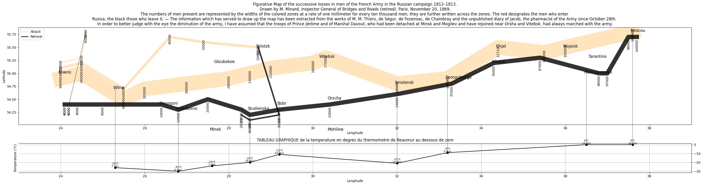

# **Minard's 1812 Troop Visualization Reproduction By Matplotlib**

This project **recreates Charles Minard’s famous 1869 visualization** of Napoleon’s **1812 Russian campaign**, depicting troop movements, losses, and temperature variations.

## **🖼️ Sample Visualization**
<p align="center">  </p>

--- 
## **📊 Overview**
Minard’s visualization is a **masterpiece of data storytelling**, illustrating:
- **Troop movement** from France to Russia (**width represents troop size**).
- **Attack & retreat phases** (attack in **tan**, retreat in **black**).
- **Geographical mapping** (longitude, latitude).
- **Temperature impact on troops** (separate timeline graph).

This project **faithfully reproduces the original visualization** using Python.

---

## **📈 Visualization Breakdown**
- Plot troop movement (thickness represents army size).
- Differentiate attack & retreat phases using colors.
- Annotate key locations (e.g., Moscow, Smolensk).
- Overlay temperature data on a secondary plot.

---
## **🔹 Key Steps in Visualization**
- 1️⃣ Create a Multi-Row Figure (Troop & Temperature Plots)
```python
fig = plt.figure(figsize=(30, 8))
gs = gridspec.GridSpec(2, 1, height_ratios=[1, 0.3])  # Top plot is larger
ax1 = plt.subplot(gs[0])  # Troop movement
ax2 = plt.subplot(gs[1])  # Temperature
```
- 2️⃣ Plot Troop Movements (Attack & Retreat)
```python
for direction, color in zip(['A', 'R'], ['navajowhite', 'black']):
    subset = troops[troops['direction'] == direction]
    for group_id in subset['group'].unique():
        group_data = subset[subset['group'] == group_id]
        ax1.plot(
            group_data['long'], group_data['lat'], 
            color=color, linewidth=group_data['survivors'].iloc[0] / 7500, alpha=0.8
        )
```

- 3️⃣ Overlay Temperature Data on a Second Plot
```python
for direction, color in zip(['A', 'R'], ['navajowhite', 'black']):
    subset = troops[troops['direction'] == direction]
    for group_id in subset['group'].unique():
        group_data = subset[subset['group'] == group_id]
        ax1.plot(
            group_data['long'], group_data['lat'], 
            color=color, linewidth=group_data['survivors'].iloc[0] / 7500, alpha=0.8
        )
```

- 4️⃣ Connect Cities to Their Temperature Readings
```python
con = ConnectionPatch(
    xyA=(long, lat), xyB=(long, temp_value),
    coordsA="data", coordsB="data",
    axesA=ax1, axesB=ax2,
    color="black", linestyle="-", alpha=0.5
)
ax2.add_artist(con)
```
